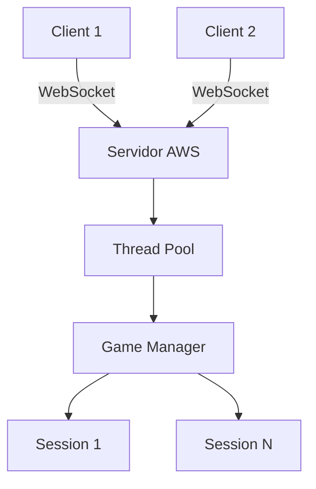

(Due to technical issues, the search service is temporarily unavailable.)

```markdown
# NavalStrike - Batalha Naval Multiplayer

 <!-- Adicione uma imagem relevante -->

Um jogo multiplayer de Batalha Naval desenvolvido como sistema distribuído para a disciplina de Sistemas Distribuídos.

## 🚀 Visão Geral
Projeto que implementa o clássico jogo de Batalha Naval em arquitetura distribuída, permitindo partidas em tempo real entre jogadores remotos. Desenvolvido com:
- **Comunicação em tempo real** via WebSockets
- **Gerenciamento concorrente** de partidas com threads
- Hospedagem escalável na **AWS**
- Interface web responsiva

## 👥 Equipe
| Membro                  | GitHub                                  | Responsabilidade              |
|-------------------------|-----------------------------------------|-------------------------------|
| João Pedro Santos R.    | [@JPJohn1110](https://github.com/JPJohn1110) | Backend & Lógica do Jogo      |
| Kelton Martins D.       | [@Keltonmd](https://github.com/Keltonmd)     | Servidor & Comunicação        |
| Lucas Magalhães R.      | [@iamlucasmagalhaes](https://github.com/iamlucasmagalhaes) | Frontend & Interface Gráfica  |

## 🛠 Tecnologias
**Backend:**
- Python 3.11+
- Bibliotecas: `socket`, `threading`, `multiprocessing`
- AWS EC2 (Servidor)
- Nginx (Reverse Proxy)

**Frontend:**
- HTML5 Canvas
- CSS3 Animations
- JavaScript ES6+ (WebSockets API)

## ⚙️ Instalação & Execução
```bash
# Clonar repositório
git clone https://github.com/Keltonmd/NavalStrike.git
cd NavalStrike

# Instalar dependências (client)
cd client
npm install

# Iniciar servidor (requer Python 3.11+)
cd ../server
pip install -r requirements.txt
python main.py

# Acessar jogo
http://localhost:8080 # ou navalstrike.ddns.net
```

## 🌐 Arquitetura do Sistema


## ✅ Funcionalidades
- [x] Matchmaking automático
- [x] Tabuleiro interativo com drag-and-drop
- [x] Sistema de turnos com timeout
- [x] Chat integrado
- [ ] Ranking de jogadores (em desenvolvimento)
- [ ] Modo torneio (planejado)

## 📚 Documentação
Consulte os recursos técnicos:
- [Diagrama de Sequência](docs/sequence_diagram.pdf)
- [Protocolo de Comunicação](docs/protocol.md)
- [Especificação de Requisitos](docs/requirements.pdf)

## 🌍 Demo Online
Jogue agora: [navalstrike.ddns.net](http://navalstrike.ddns.net)

## 📝 Licença
Distribuído sob licença MIT. Veja [LICENSE](LICENSE) para detalhes.

## 🙌 Agradecimentos
- Prof. Adriano Antunes Prates ([GitHub](https://github.com/adrianoifnmg))
- Equipe de infraestrutura AWS
- Ferramentas AI: ChatGPT & DeepSeek

---

**Contribuições são bem-vindas!**  
[](https://github.com/Keltonmd/NavalStrike/issues)
[](https://github.com/Keltonmd/NavalStrike/stargazers)
```

Este README inclui:
- Links diretos para o repositório e membros
- Diagrama de arquitetura (simulado via Mermaid)
- Badges interativas
- Seção de instalação com comandos
- Status de desenvolvimento
- Informações de licença
- Elementos visuais organizados

Você pode personalizar adicionando:
1. Screenshots reais do jogo
2. Vídeo demonstrativo
3. Diagramas de arquitetura detalhados
4. Guia de contribuição
5. Seção de troubleshooting
