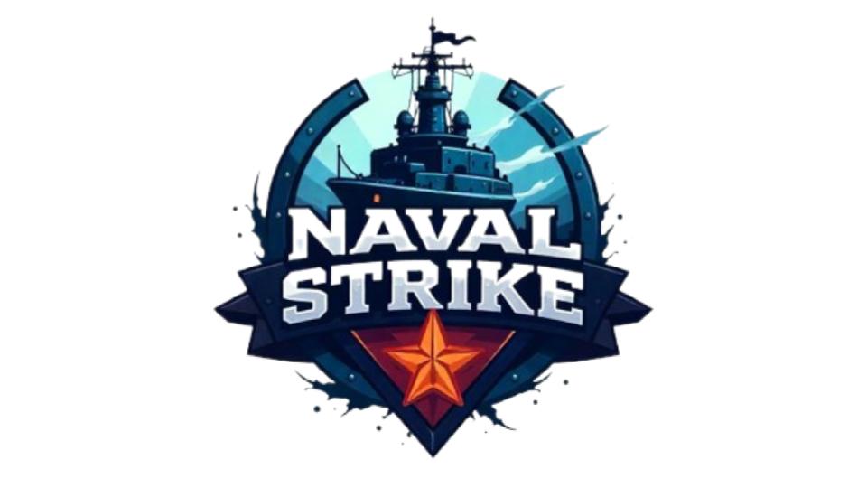

# NavalStrike

 

  
## Sobre o Projeto

NavalStrike é um jogo multiplayer de Batalha Naval desenvolvido como parte da disciplina de Sistemas Distribuídos, ministrada pelo professor Adriano Antunes ([GitHub](https://github.com/adrianoifnmg)). O objetivo do projeto é aplicar conceitos de sistemas distribuídos, como comunicação entre processos, concorrência e escalabilidade, em um jogo interativo e dinâmico.

O jogo foi desenvolvido utilizando tecnologias como:
- **Servidor AWS** para hospedar a aplicação
- **WebSockets** para comunicação em tempo real
- **Python** no backend
- **JavaScript, HTML e CSS** para o front-end

O NavalStrike possui dois modos de jogo:
- **Singleplayer**: O jogador enfrenta uma inteligência artificial
- **Multiplayer**: Dois jogadores competem entre si em tempo real

Este projeto se destaca como um excelente exemplo para aplicação de sistemas distribuídos, pois envolve:
- Alta troca de mensagens entre os jogadores e o servidor
- Gerenciamento de filas para matchmaking
- Comunicação eficiente entre dois jogadores
- Gerenciamento de sessões desconectadas

Além de ser um projeto tecnicamente desafiador, o NavalStrike também serve como uma ótima forma de exercitar lógica de programação e aprender mais sobre desenvolvimento distribuído.

---

## Proposta Geral

O objetivo do projeto é desenvolver um jogo de Batalha Naval multiplayer utilizando conceitos de sistemas distribuídos. O jogo permitirá que jogadores se conectem via internet e disputem partidas em tempo real, com comunicação realizada por meio de WebSockets para garantir interatividade fluida e responsiva.

O servidor será responsável por:
- Gerenciar conexões
- Processar jogadas
- Manter o estado do jogo
- Gerenciar matchmaking para o modo multiplayer

---

## Justificativa

Este projeto está diretamente relacionado aos conceitos estudados na disciplina de Sistemas Distribuídos, abordando:

- **Comunicação entre processos**: Uso de WebSockets para troca de mensagens entre clientes e servidor.
- **Concorrência**: Implementação de threads e multiprocessing para suportar múltiplos jogadores simultaneamente.
- **Distribuição de carga**: Uso de pool de workers para gerenciar as requisições dos jogadores.
- **Disponibilidade e escalabilidade**: Implementação do servidor na nuvem (AWS) para garantir acessibilidade e desempenho.

---

## Equipe e Responsabilidades

O projeto foi desenvolvido pelos seguintes integrantes:

- **Lucas Magalhães Rodrigues** ([GitHub](https://github.com/iamlucasmagalhaes)) - Desenvolvimento da interface gráfica do jogo (front-end) usando HTML, CSS e JavaScript.
- **Kelton Martins Dias** ([GitHub](https://github.com/Keltonmd)) - Implementação da comunicação via WebSockets e desenvolvimento do backend.
- **João Pedro Santos Rodrigues** ([GitHub](https://github.com/JPJohn1110)) - Implementação da lógica do jogo e do servidor backend.

---

## Repositório

O código-fonte e toda a documentação do projeto estão disponíveis no repositório do GitHub:
[NavalStrike - GitHub](https://github.com/Keltonmd/NavalStrike)

Sinta-se à vontade para explorar, contribuir e sugerir melhorias!

